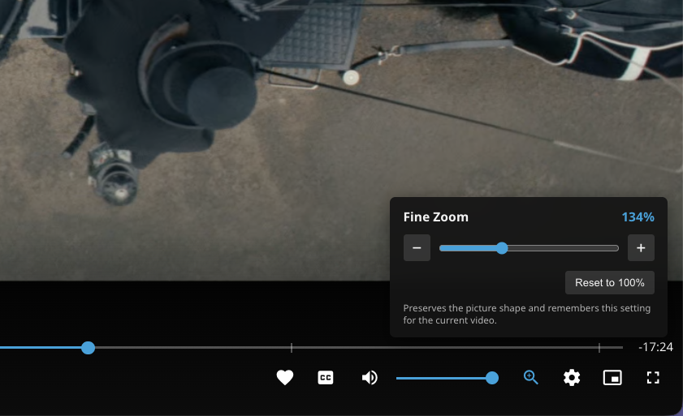

# Fine Zoom for Jellyfin

Fine Zoom adds a 100-200% video zoom slider with 1% steps to Jellyfin Web. It is
designed for ultrawide displays and videos that contain hard-coded black bars.



The control appears beside Jellyfin's playback settings button. Zoom preserves
the picture's proportions, includes one-percent decrease/increase buttons and a
reset button, and remembers the selected value for each video on that browser.

## Compatibility

- Jellyfin Server 12.0
- Browsers and clients based on Jellyfin Web

Fine Zoom cannot affect independently implemented native video players. Native
or bitmap subtitles may scale with the video and can be cropped at high zoom
levels; client-rendered text subtitles remain in place.

## Install from a repository

Copy this URL and add it under **Dashboard → Plugins → Repositories**:

```text
https://raw.githubusercontent.com/alexcroox/jellyfin-plugin-fine-zoom/main/manifest.json
```

Then install **Fine Zoom** from the plugin catalog and restart Jellyfin. After
restarting, hard-refresh Jellyfin Web so the browser does not reuse its cached
pre-plugin application shell (`Ctrl+Shift+R` on Windows/Linux,
`Cmd+Shift+R` in Chrome/Edge on macOS, or `Option+Cmd+R` in Safari).

## Manual installation

Copy `Jellyfin.Plugin.FineZoom.dll` and `BINARY-LICENSE` into a
`Fine Zoom_1.0.1.0` directory beneath Jellyfin's plugins directory, then
restart Jellyfin and hard-refresh Jellyfin Web.

## Technical note

An upstream Jellyfin Web pull request,
[#7627: Custom aspect ratio to zoom / scale videos](https://github.com/jellyfin/jellyfin-web/pull/7627),
implemented this functionality directly in the client without runtime script
injection. It received no interest so I created a plugin instead.

Jellyfin does not currently provide a supported server-plugin extension point
for playback controls. Fine Zoom injects its embedded client component into the
Jellyfin Web shell at request time and does not modify Jellyfin Web files on
disk. A Jellyfin Web update may therefore require an update to this plugin.

## Building

```sh
dotnet publish Jellyfin.Plugin.FineZoom/Jellyfin.Plugin.FineZoom.csproj \
  --configuration Release \
  --output artifacts/publish
```

## License

The original source code is available under the MIT License. Distributed
plugin binaries link against Jellyfin's GPLv3 libraries and are distributed
under GPLv3; see `BINARY-LICENSE`.
